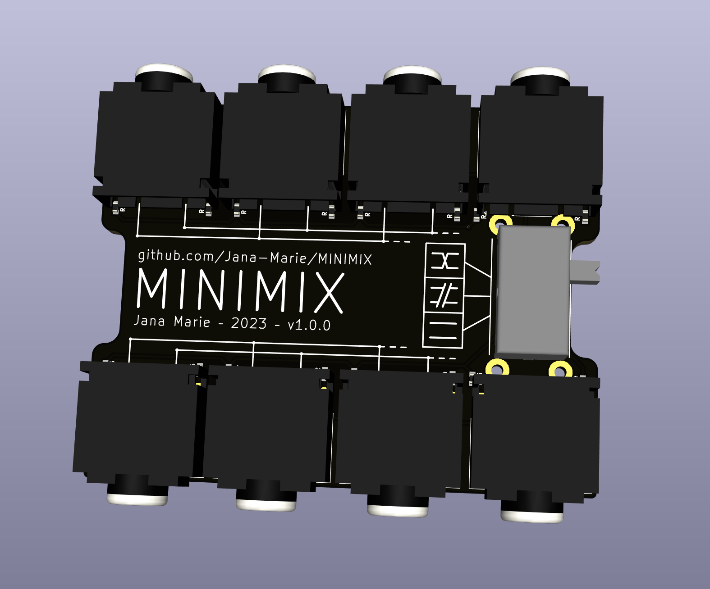

# MINIMIX

Since my audio setup is running out of inputs, and especially since I usually only need to change my main volume I created the MINIMIX, a minimal 2x4 or 1x8 audio mixer.

## License

Copyright Jana Marie Hemsing 2023. This source describes Open Hardware and is licensed under the CERN- OHL-S v2.

You may redistribute and modify this source and make products using it under the terms of the CERN-OHL-S v2 (LICENSE).

This source is distributed WITHOUT ANY EXPRESS OR IMPLIED WARRANTY, INCLUDING OF MERCHANTABILITY, SATISFACTORY QUALITY AND FITNESS FOR A PARTICULAR PURPOSE. Please see the CERN-OHL-S v2 for applicable conditions.

Source location: https://github.com/Jana-Marie/MINIMIX/ As per CERN-OHL-S v2 section 4, should You produce hardware based on this source, You must where practicable maintain the Source Location visible on the external case of MINIMIX or other products you make using this source
